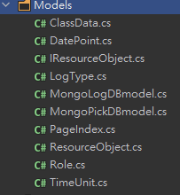

# WPF 與 MongoDB 目錄結構說明 !

*. WPF 首頁

*. Directory: 目錄結構如下

*. d/f  目錄/檔名 :: 只對WPF有使用到mongoDB的目錄做解釋

----  ------- ----
d-----Models

    --MongoDB Model對應MVC裡面的Ｍ，有兩部份，一是抓取紀錄(MongoPickDBmodel.cs)，二是錯誤紀錄(MongologDBmodel.cs)

d-----Services

    --MongoDB Service對應MVC裡面的C(controller)，有兩部份，一是抓取紀錄(MongoPickMongoServices.cs)，二是錯誤紀錄(MongoLogMongoServices.cs)

d-----UserControls

    --對應WPF UI的細部元件之使用者控制邏輯撰寫

d-----ViewModels

    --對應WPF UI的頁面之使用者控制邏輯撰寫

d-----Views

    --對應WPF UI的頁面之Layout之設計與對應binding ViewModel跟UserControl的Method邏輯撰寫

d-----Selectors

d-----Dependencies

d-----Properities

d-----Converters

d-----Core

d-----Images

d-----Languages

d-----Libraries

d-----Resources

d-----Styles

-f----App.config

-f----App.xaml

-f----App.xaml.cs

-f----MainWindows.xaml

