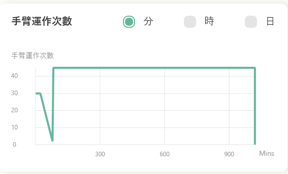
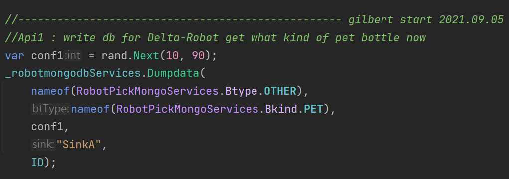
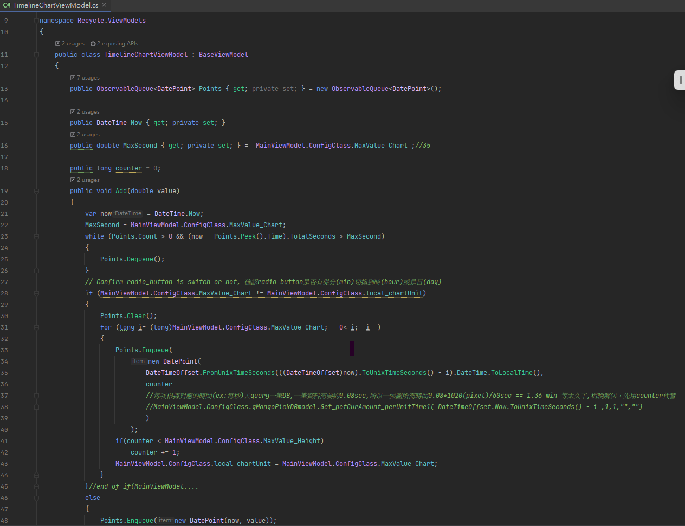

# Intro2-1 ; 

### MongoDB API_1-1使用說明!

Controller部分：Services對應MVC裡面的C有兩部份，一是抓取紀錄API_1，二是錯誤紀錄API_2

圖、mongoDB Services兩個API_1和API_2的所在目錄

WPF對應API_1(RobotPickMongoService.cs):

https://github.com/gilbert-sun/Recycle_1.7/blob/master/Services/robotmongodbServices-old.cs 

呼叫API_1:Dumpdata(p1,p2,p3,p4,p5)抓取紀錄
*.p1:七類([0:P],[1:O],[2:S],[3:C],[4:Ot],[5:Ch],[6:T])
*.p2:六類([0:PET],[1:PS],[2:PP],…)
*.p3:conf1信心值:yolov3/v4得到的信心值
*.p4:sinkA/B/C/D 儲存槽：A/B/C/D選擇
*.p5:ID:代表機械手臂ID

