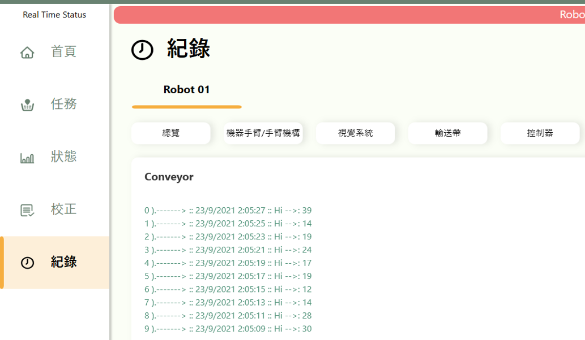
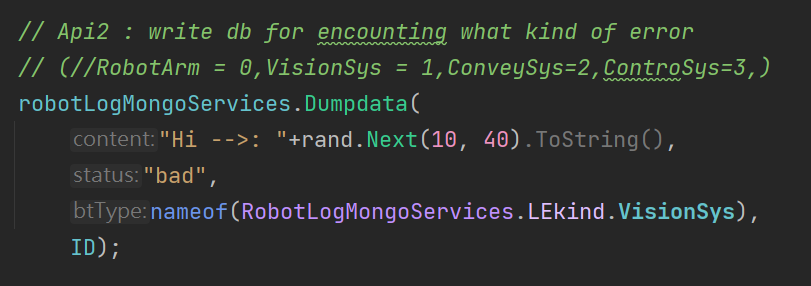

# 紀錄_細部說明

### MongoDB API_3使用說明!

MongoLogDB_Model(二，錯誤紀錄)：

對應紀錄(Record)的紀錄寶特瓶的錯誤紀錄，有輸送帶/視覺系統/手臂/控制器共四種類別的錯誤紀錄

Table2錯誤紀錄相關欄位設計如下圖錯誤資料設計欄位跟對應欄位程式碼

相關細節請參考程式碼

https://github.com/gilbert-sun/Recycle_1.7/blob/master/Models/MongoLogDBmodel.cs 

WPF對應API_2(RobotLogMongoService.cs):

https://github.com/gilbert-sun/Recycle_1.7/blob/master/Services/RobotLogMongoServices.cs 

呼叫API_2:Dumpdata(p1,p2,p3,p4)錯誤紀錄

*.p1:char(錯誤內容描述)

*.p2:status([0:bad],[1:good])

*.p3::四類([0:手臂],[1:視覺],[2:輸送帶],[3:控制器])

*.p4:ID:代表機械手臂ID

