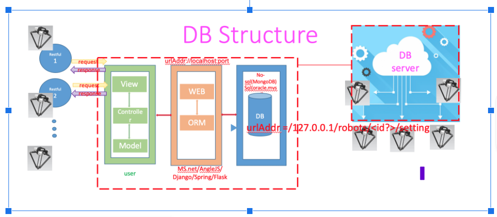
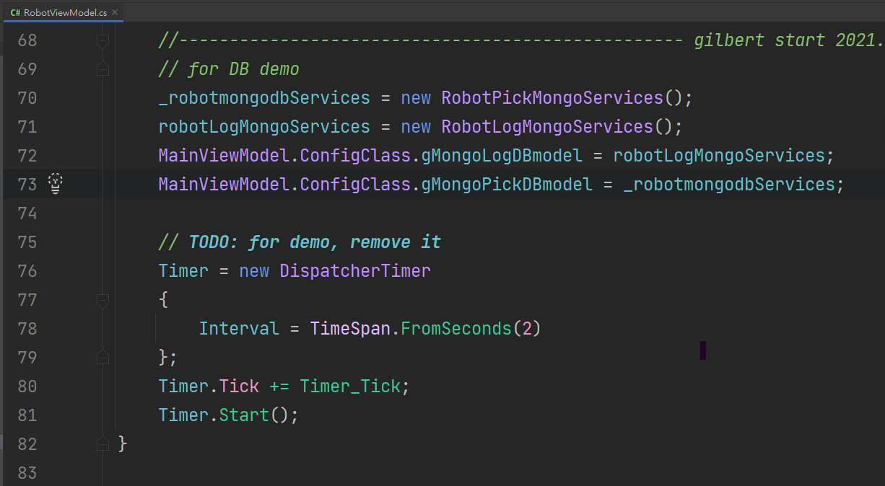
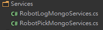
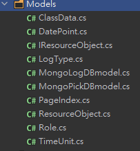
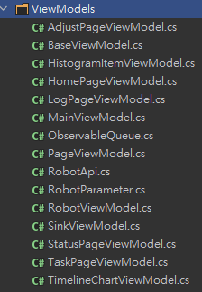
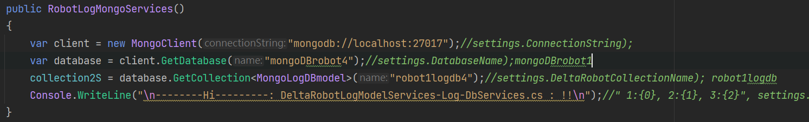
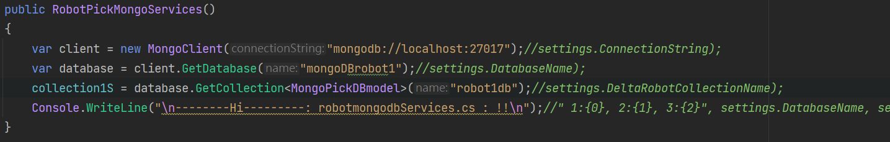
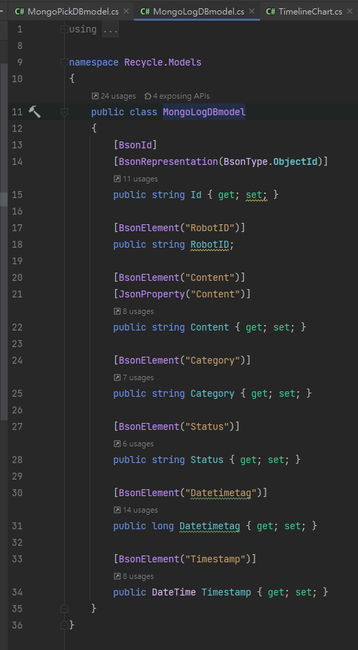
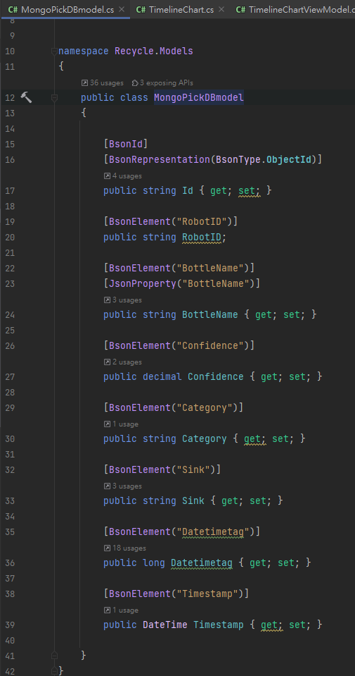

#  MongoDB MVC結構與初始化和設定 in here!

WPF MongoPickDB_Model(一，抓取紀錄)：

WPF對應首頁(Main)的寶特瓶抓取的分時日圖

WPF對應任務(Task) 4個Sink抓取每天總數量

Table1抓取紀錄相關欄位設計如下圖資料設計欄位跟對應欄位程式碼

相關細節請參考程式碼

https://github.com/gilbert-sun/Recycle_1.7/blob/master/Models/MongoPickDBmodel.cs 

 

